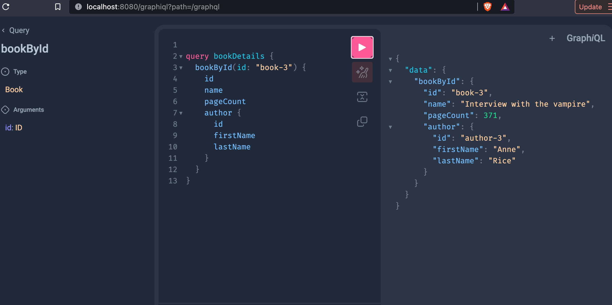

# Spring Boot Graphql for Books API


## GraphQL API

```graphql
type Query {
    bookById(id: ID): Book
}

type Book {
    id: ID
    name: String
    pageCount: Int
    author: Author
}

type Author {
    id: ID
    firstName: String
    lastName: String
}
```

## localhost:8080/graphqli



## Resource

